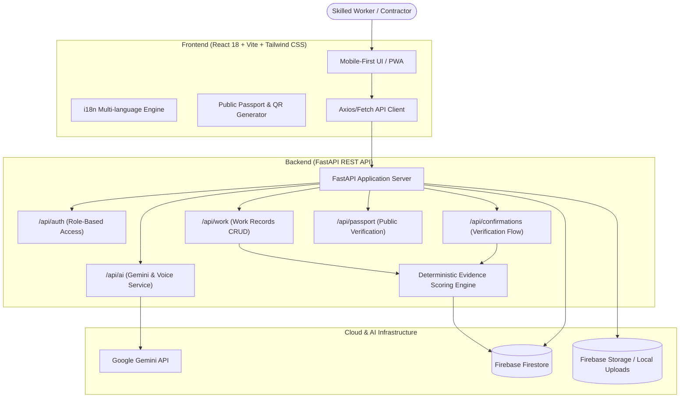

<div align="center">

# 🛡️ VOUCH
### *Your work. Vouched for.*

**A portable, evidence-backed digital professional identity platform for skilled trades and hands-on workers.**

[](https://github.com/cybernautscseevents/HTO-05)
[](https://react.dev)
[](https://tailwindcss.com)
[](https://fastapi.tiangolo.com)
[](https://firebase.google.com)
[](https://ai.google.dev)

---

</div>

## 📌 Overview

**VOUCH** addresses the massive **Professional Identity Gap** faced by informal and skilled trade workers (electricians, solar technicians, carpenters, plumbers, HVAC technicians). 

While skilled workers accumulate years of hands-on mastery, their work history remains scattered across personal memory, ephemeral WhatsApp chats, handwritten receipts, and verbal references. When they switch employers, move cities, or seek high-value commercial contracts, they start from zero.

> **VOUCH is not a job marketplace.** It is a worker-owned, verifiable professional reputation and evidence layer.

Workers own and control their digital record, attach real project evidence, receive friction-free third-party attestations, and share a verified **Public Professional Passport** via a simple link or dynamic QR code.

---

## ⚡ The Core Demo Loop

```
Worker Speaks / Types Work Description
           │
           ▼
[Google Gemini AI Engine] ───► Auto-extracts tasks, duration, equipment & skills
           │
           ▼
[Evidence Attachment]    ───► Uploads site photos, completion receipts, geo-tag
           │
           ▼
[Frictionless Confirm]   ───► Supervisor/Client receives instant SMS/WhatsApp link (No app/login needed)
           │
           ▼
[Evidence Engine]        ───► Computes deterministic, explainable 0–100% confidence score
           │
           ▼
[Public Passport + QR]   ───► Portable professional portfolio instantly verifiable anywhere
```

---

## ✨ Key Features & Innovations

- 🎙️ **Voice-First AI Intake**: Natural voice or unstructured text input is instantly parsed into structured work records with standardized skill taxonomy powered by Google Gemini.
- 📐 **Deterministic Evidence Confidence Engine**: No opaque black-box AI ratings. Evidence score (0–100%) is calculated using transparent mathematical rules:
  - Base Record: 20%
  - Photo / Document Evidence: +25%
  - Customer / Supervisor Confirmation: +35%
  - Direct Contractor / Employer Endorsement: +20%
- 📲 **Zero-Friction Third-Party Verification**: Supervisors and clients can verify completed work in 10 seconds via lightweight web tokens without creating an account or downloading an app.
- 🪪 **Public Professional Passport**: A responsive, verifiable digital passport showing verified hours, verified skills, and photographic audit trails.
- 📱 **Mobile-First & Multilingual**: Tailored for tradespeople on active job sites with high contrast, touch-friendly UI, and multilingual support (English, Hindi, and regional languages).
- 🔍 **Contractor & Employer Discovery Portal**: General contractors can inspect verified portfolios, skill credentials, and confidence breakdowns before hiring.

---

## 🏗️ System Architecture



---

## 📁 Project Directory Structure

```text
HTO-05/
├── ai/                          # AI extraction & voice transcription modules
│   ├── voice_transcription/     # Audio processing & speech-to-text providers
│   └── worker_extraction/       # Gemini prompts, schemas, and fallback extractors
├── backend/                     # FastAPI backend application
│   ├── app/
│   │   ├── api/                 # REST endpoints (workers, work, confirmations, passport, ai)
│   │   ├── core/                # Configuration, security, Firebase admin SDK
│   │   ├── schemas/             # Pydantic data models & contracts
│   │   └── services/            # Evidence engine, AI service, data service
│   ├── requirements.txt         # Python dependencies
│   └── tests/                   # Backend unit and integration test suite
├── frontend/                    # Vite + React + TypeScript frontend
│   ├── public/                  # Static assets and sample images
│   ├── src/
│   │   ├── components/          # Reusable UI components (TopBar, BottomNav, LanguageSelector)
│   │   ├── context/             # React application context
│   │   ├── i18n/                # Internationalization & translations
│   │   ├── modals/              # AddWork, QR Share, Verifier modals
│   │   ├── pages/               # Worker app, Contractor app, Public Passport, Landing pages
│   │   └── services/            # API client and backend connectors
│   └── package.json             # Frontend dependencies and build scripts
├── docs/                        # Complete product & architecture specifications
│   ├── 01-product-spec.md
│   ├── 02-engineering-architecture.md
│   ├── 03-data-model.md
│   ├── 04-api-contract.md
│   ├── 05-ui-design-system.md
│   ├── 06-ai-evidence-engine.md
│   └── 08-demo-script.md
├── start-dev.bat                # 1-Click launcher for both Frontend & Backend
└── README.md                    # Project documentation
```

---

## 🚀 Quick Start Guide

### Prerequisites
- **Node.js**: v18.0.0 or higher
- **Python**: v3.11 or v3.12
- **Git**

### ⚡ One-Click Start (Windows)
Double-click or run:
```cmd
start-dev.bat
```
This automatically boots:
- **FastAPI Backend**: `http://127.0.0.1:8000` (API & Swagger Docs)
- **Vite Frontend**: `http://localhost:5173`

---

### 🛠️ Manual Step-by-Step Setup

#### 1. Backend Setup
```bash
# Navigate to backend
cd backend

# Create & activate virtual environment
python -m venv venv

# Windows
.\venv\Scripts\activate

# Linux/macOS
source venv/bin/activate

# Install dependencies
pip install -r requirements.txt

# Configure environment variables
copy .env.example .env     # (On Linux/macOS use: cp .env.example .env)

# Run development server
uvicorn app.main:app --host 127.0.0.1 --port 8000 --reload
```
Interactive Swagger Documentation will be live at:
👉 **http://127.0.0.1:8000/docs**

#### 2. Frontend Setup
```bash
# Open a new terminal and navigate to frontend
cd frontend

# Install dependencies
npm install

# Configure environment variables
copy .env.example .env     # (On Linux/macOS use: cp .env.example .env)

# Start Vite dev server
npm run dev
```
Web Application will be accessible at:
👉 **http://localhost:5173**

---

## 🔒 Security & Best Practices

- **Strict Environment Isolation**: API keys, Firebase service accounts, and session tokens are strictly kept in local `.env` files that are untracked by Git.
- **Explainable Trust Metrics**: Scoring formulas are transparent and audit-logged to avoid biased algorithmic gating.
- **Privacy-First Public Passports**: Workers select exactly which projects, photos, and personal details are publicly visible on their passport.

---

## 👥 Hackathon Team HTO-05

Developed with ❤️ for the **Cybernauts CSE Hackathon**.
- **Team**: HTO-05
- **Repository**: [cybernautscseevents/HTO-05](https://github.com/cybernautscseevents/HTO-05)
